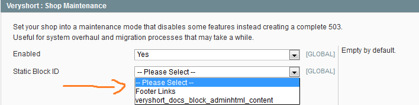
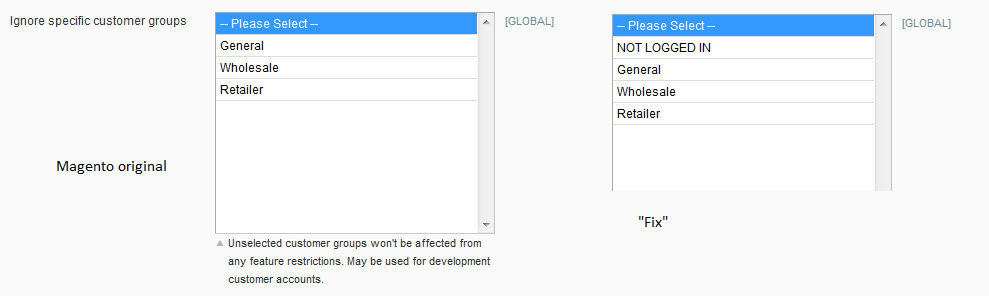

# Adminhtml selections

- [About](#about)
- [Examples](#examples)
- [How to use](#how-to-use)
- [Compatibility](#compatibility)

  

## About

Features

- Allow specific static block selection within an admin module configuration.
  - Useful if you want to implement custom text and shop data and separate the CMS part from the admin part (which is good for user ACL and separation of concerns in general).
  - Allow not selecting anything for default/reset purposes.
- Allow selection of 'NOT LOGGED IN' customer group by removing the filter. Useful for custom extension feature configuration.

  

## Examples

  

## How to use

1. Disable compiler and caches.
2. Copy the classes to their belonging folders under `app/code/core/*`.
3. Test out if the module work in the admin.
4. Reset compiler and caches previous state.

  

## Compatibility

Tested with: Magento CE 1.6.0.0

