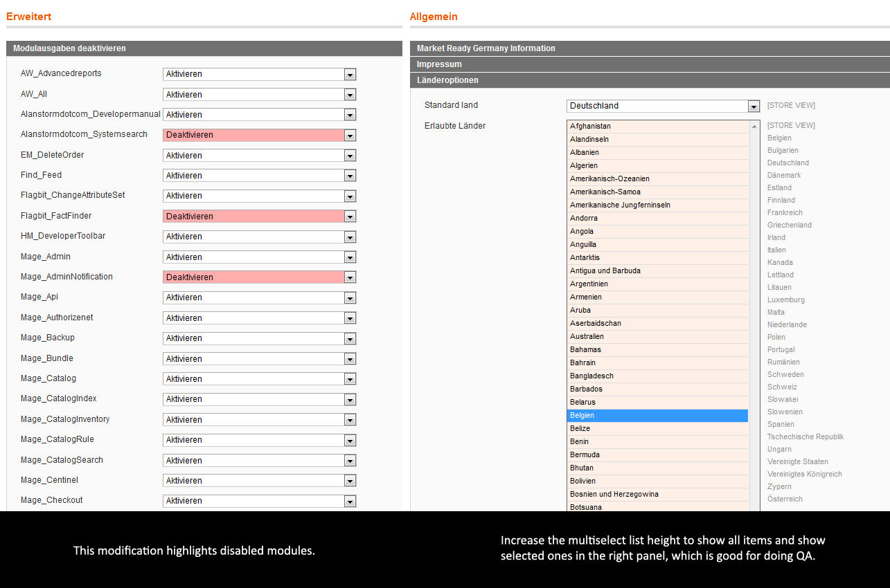

# Adminhtml theme usability

- [About](#about)
- [How to use](#how-to-use)
- [Compatibility](#compatibility)

  

## About

Features

- Improved backend skin styles:
  - Replace the old color by one that follows the Magento CI.
  - Added Form element hover/focus states.
- Large multiselect dropdowns (e.g. for countries).
  - Easy to extend in the JS file: `skin/js/main.js`.
  - Also show which elements you selected.
- Highlight disabled modules in the admin panel.

  

## Examples

  

## How to use

1. Create a custom adminhtml theme with design and skin.

  

## Compatibility

Tested with: Magento CE 1.5.1.0

