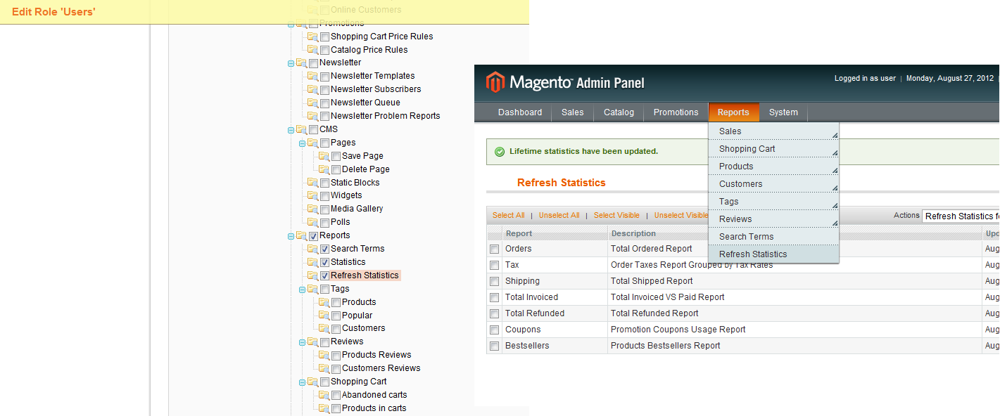

# Reports - Refresh user stats

- [About](#about)
- [How to use](#how-to-use)
- [Compatibility](#compatibility)

  

## About

The menu item 'Refresh Statistics' was missing in the ACL settings. Sometimes it's good if users and not only administrators can use this feature.

  

## Examples

  

## How to use

This is a simple single-file modification. Please read the comment in `adminhtml.xml` for installation.

  

## Compatibility

Tested with: Magento CE 1.6.0.0

